# SOS Mascotas
SOS Mascotas es una app diseñada para encontrar centros veterinarios cerca de ti, saber cuáles están abiertos en la noche y para conseguir transporte para tu mascota

## Desarrollado para [Laboratoria](http://laboratoria.la)

# Primera parte: Descubrimiento
Navegando por Facebook, específicamente en redes de mascotas, tenencia responsable, adopciones y ayuda a animales abandonados, es común encontrar a usuarios que ante una eventualidad no saben a dónde dirigirse.

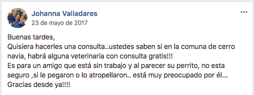

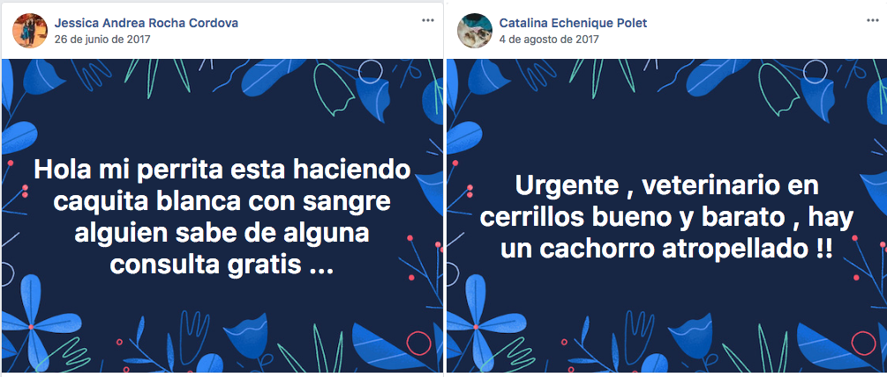

Estos usuarios hacen una publicación preguntando datos cercanos y por sobre todo económicos, pero en estos sitios ocurren dos fenómenos que juegan en contra para aquella persona que, ante una urgencia, necesita un dato rápido:

- Los usuarios no siempre están conectados, por lo que pasa mucho tiempo antes de que alguien le responda a esa persona que está en una situación donde requiere de una respuesta inmediata.

- En esos foros de Facebook se publican contenidos de todo tipo: desde animales en adopción, solicitud de aportes económicos, animales perdidos, denuncias por maltrato, entre otros. El efecto de esta mezcla de publicaciones, es que las que son de carácter urgente, se pierden entre las demás, van quedando cada vez más abajo en el timeline de la página y finalmente ya nadie las ve, perjudicando al usuario que pedía ayuda y a su mascota.

Por ello nació la inquietud de cómo ayudar a aquellos casos en donde la persona, desorientada, busca un lugar (con características específicas como precio, cercanía, horario, etc) para acudir de urgencia.
Es decir, sabe dónde acudir ante una emergencia veterinaria, optimizando el tiempo: que sea un lugar cercano y que atiendan de inmediato.

# Segunda parte: Research

## Encuestas y entrevistas

Ante este panorama, realicé una pequeña encuesta de Facebook en algunos de estos grupos de ayuda a animales, enfocada a las atenciones de urgencia.
Las encuestas arrojaron dos panoramas muy diferentes: si tuvieran una emergencia en horario normal (de día, en la semana), un 68% de las personas afirmó saber a donde dirigirse.

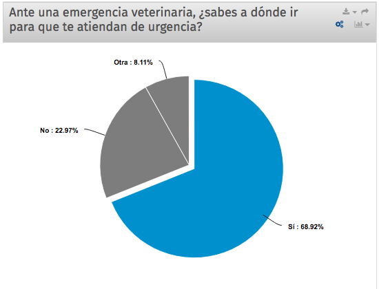

Pero esta situación cambia cuando se les pregunta lo mismo, pero si ocurriera en horario inhábil (entre 20:00 y 8:00 hrs, y feriados y fines de semana todo el día). Esta encuesta arrojó que de un total de 136 personas que respondieron, 74 contestaron que sí y 61 que no, representando un 45%.

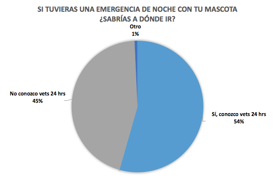

Este resultado puede deberse también a que actualmente a nivel de país, y en la capital, la cantidad de lugares que atienden 24 hrs, feriados y fines de semana son muy pocos. Hay que sumar también que la dificultad para encontrar estos datos fomenta la desinformación.

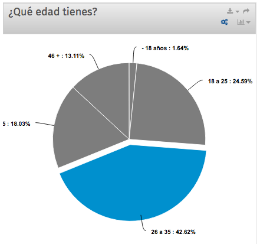

Estas encuestas de tipo cuantitativas de difundieron por redes sociales, principalmente en estos grupos de amantes de los animales. El público mayoritario que respondió es gente del rango de edad de los 26 a 35 años, con más de 5 mascotas, y que han llegado a los datos de veterinarios que conocen a través de internet (43,84%), lo que da una clara señal de que son un segmento hiperconectado con la tecnología y las redes.

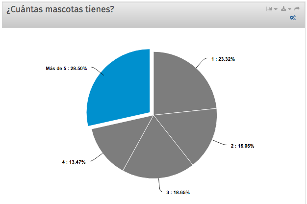

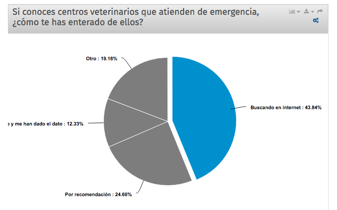

El 19,18% que escogió “otro”, respondió que los conoce porque los ha visto en la calle:
“está cerca de mi casa”
“al pasar he visto los carteles”
“he visto uno que dice afuera que atiende las 24 hrs” “buscando en la calle”
“está en la esquina”

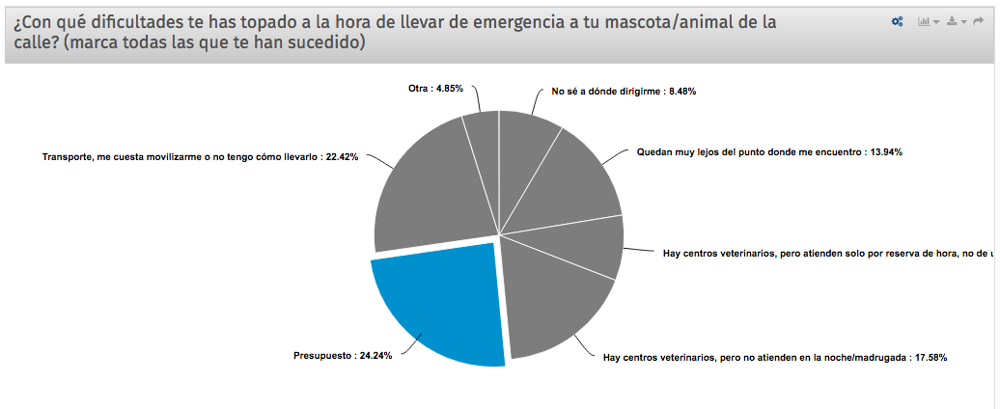

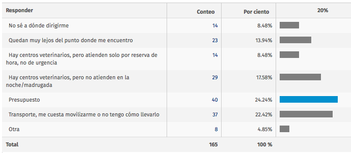

La pregunta “¿Con qué dificultades te has topado a la hora de llevar de emergencia a tu mascota?”, arrojó que para un 24,24% el mayor problema ha sido el presupuesto, seguido de el transporte (22,42%), y en tercer lugar que no hay atención veterinaria de noche/madrugada (horario inhábil).
La misma pregunta, pero abierta, para que la gente se pudiera explayar a su antojo, siguió el mismo patrón: la mayoría de las respuestas siguieron siendo problemas de movilización, ausencia de veterinarias 24 hrs y presupuesto o cobros excesivamente altos:

Algunos de los problemas de los usuarios al momento de una emergencia veterinaria son:

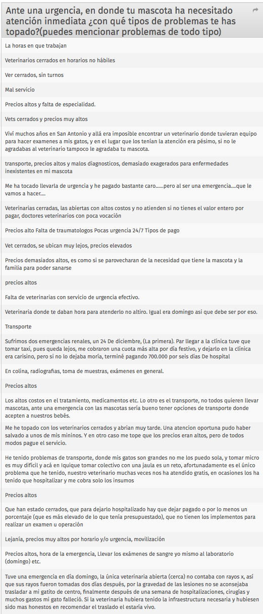

En cuanto a los tipos de emergencia que han vivido, son muy diversos, desde cuadros ambulatorios, hasta situaciones graves y/o enfermedades, que algunos han desencadenado con el fallecimiento del animal.

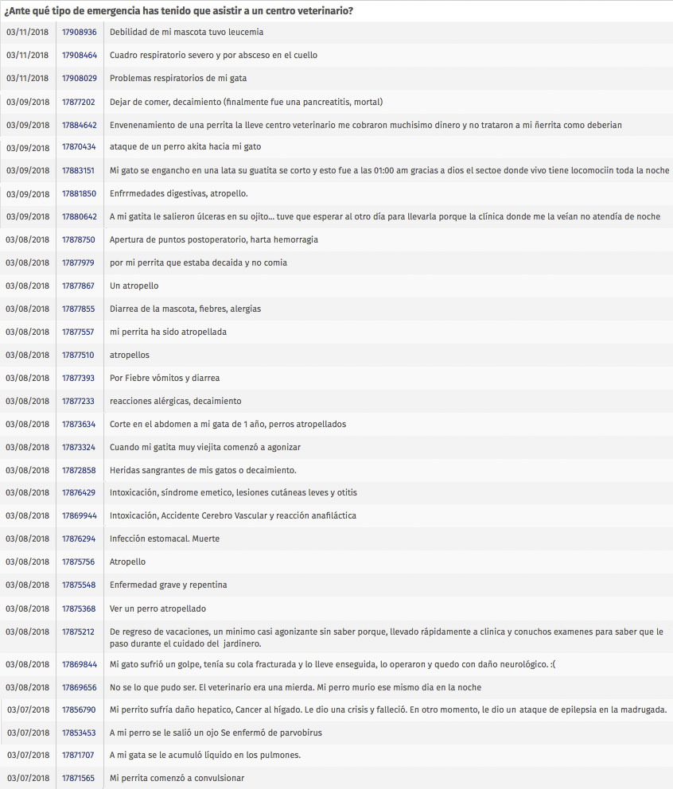

## Conclusiones y objetivos

- Si ocurre una emergencia dentro del horario normal de atención (por lo general de 9 a 20 hrs) saben donde acudir. Principalmente al centro veterinario donde sus mascotas son pacientes habituales y con los médicos que ya conocen.

- Si la emergencia ocurre fuera del horario hábil (de 20:00 a 8:59 hrs) la mayoría respondió que no sabría donde acudir y que la mayoría se inclinó a resolverlo averiguando por internet, en Google o en redes sociales, y leerían los comentarios del lugar para tener una referencia de la calidad del servicio.

- Un 63,73% contestó que lo primordial a la hora de elegir dónde llevarlos es la reputación y los comentarios de la gente sobre el centro veterinario, que les de confianza, por lo tanto las evaluaciones de los clientes son muy considerados.

- La primera dificultad en este tipo de contratiempos es el presupuesto. Le gente reclama que los precios por atención de urgencia son muy elevados. Le sigue las complicaciones para transportarse: lo más que comentaban era que muchos no tenían auto y que los taxis no siempre llevan animales a bordo, y menos si están enfermos. Y en tercer lugar está la problemática de que no todos los centros veterinarios atienden las 24 horas (17,58%).

Estos mismos problemas se repetían en las entrevistas presenciales. Escuchar acá: https://drive.google.com/drive/folders/1VzuJoChdrln3jJhcAuXNHSNoFUhJc7RI?usp=sharing

Entendido esto, el objetivo es resolver de mejor manera las conflictos recién mencionados, integrando los datos recopilados y las características de los usuarios. Brindarles la información y los servicios necesarios para mejorar la experiencia.

## User person

En el contexto donde se realizaron las encuestas y las entrevistas, se pudo concluir que el user person principal sería un usuario consciente de la responsabilidad que conlleva tener un animal adoptado y que se preocupa de que reciba la calidad de atención adecuada ante un problema.

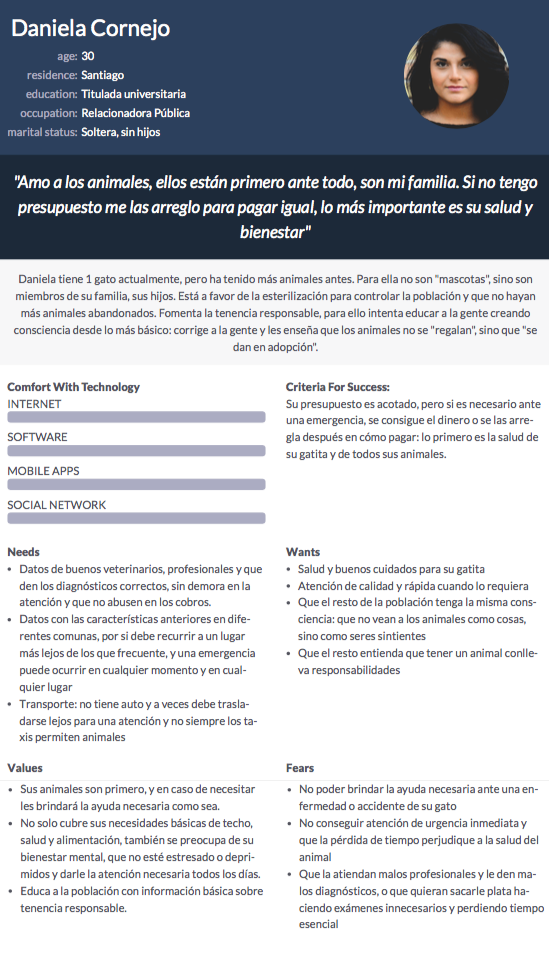

## Investigación de mercado

Considerando todo lo anterior, especialmente el factor común de que el público está muy conectado a internet, y que una emergencia implica trasladarse de un punto A a un punto B y para ello se necesita movilidad, se pensó en la creación de una app para dispositivos móviles.
Buscando en las tiendas digitales de aplicaciones, se encontraron dos dedicadas al cuidado y rescate de los animales: “Wof” y “Laika”. Están enfocadas en la tenencia responsable, donde permiten crear fichas de los animales para registrar vacunas, paseos, ofertas de productos y registrar animales abandonados o heridos a través de GPS para ayudar a su rescate. Pero ninguna de las dos cubre las problemáticas de este estudio.

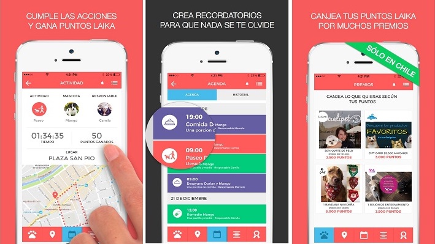
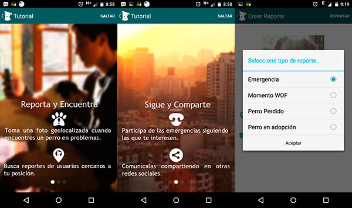

Si buscamos “clínicas veterinarias” en Google, además de mostrar anuncios y links de varios centros, nos muestra un mapa donde aparecen marcados algunos centros veterinarios de la capital. En el costado izquierdo nos enseña una lista con esos lugares, una valoración, la distancia desde el punto donde nos encontramos, teléfono, sitio web y ruta de cómo llegar. Pero la cantidad de lugares que muestra es muy acotada, y en el caso de que alguien busque el lugar más cercano, es probable que no le aparezca en el mapa y deba desplazarse a otro más lejos.

Además, no en todos los resultados muestra los datos completos. Algunos nos enseña solo la información básica como dirección y teléfono (y en otros casos ni siquiera el teléfono). Además en la ventana donde debería estar la descripción del lugar, hay texto contaminante que ensucia la pantalla y entorpece la búsqueda rápida de información esencial.

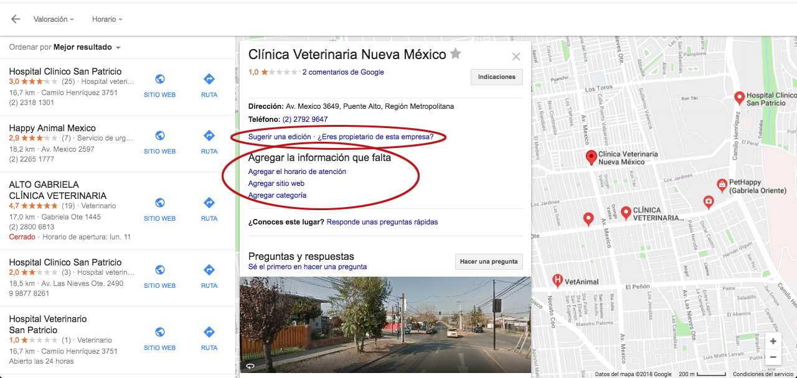
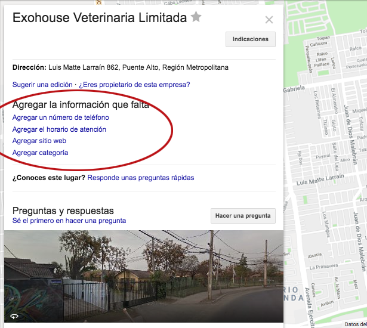

# Tercera parte: creación del producto

Con todos los datos recopilados como los problemas de presupuesto, desplazamiento, lugares cerrados por la hora o día, sus preocupaciones de fijarse en la reputación de un lugar, información incompleta en la web, etc. se llegó a la conclusión de que la app debía juntar todo esto y **ser un foco de información completa y fidedigna, actualizada y colaborativa entre usuarios, donde se ahorra tiempo en la búsqueda, entrega información actualizada, basada en la corroboración de datos y en la experiencia de las personas, que tienen en común un gran valor: el amor por los animales.**

**SOS Mascotas**

*Ver prototipo aquí:* https://marvelapp.com/31e97f8

“SOS Mascotas” se basó en las principales problemáticas de los usuarios consultados. Por esto tiene tres secciones principales en la barra inferior: **“transporte”, “centros veterinarios” y “a domicilio”.**	

El fin principal es hallar de manera rápida y eficiente un centro veterinario. Se entiende que estas situaciones ocurren cuando menos se esperan, y traen consigo una carga importante de estrés, por lo que actuar rápido es fundamental. Para ello se pensó en la sencillez y en pocos pasos para acceder a la información que se busca (logo grande rojo).

De acuerdo a la necesidad, se puede filtrar por cercanía, por precio, por valoración y por veterinarias 24 hrs.

La valoración la otorgan los mismos usuarios, donde pueden agregar comentarios sobre la experiencia que tuvieron en ese lugar.

La información como precios, infraestructura y formas de pago no es editable por el usuario. Son datos proporcionados y corroborados por “SOS Mascotas” que se van actualizando periódicamente.

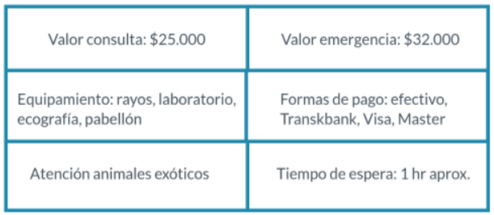

La sección “transporte” muestra una lista de usuarios que se han puesto a disposición para trasladar a quien lo necesite, cobrando de acuerdo al lugar donde tienen que ir, en horarios que ellos mismos escogen.

Esta idea nació de las redes sociales de ayuda animal, en donde mucha gente necesitaba trasladar animales de manera urgente y algunos de ofrecían a cambio del pago de la bencina u otro pequeño valor agregado.

A continuación algunos ejemplos de lo anteriormente mencionado:

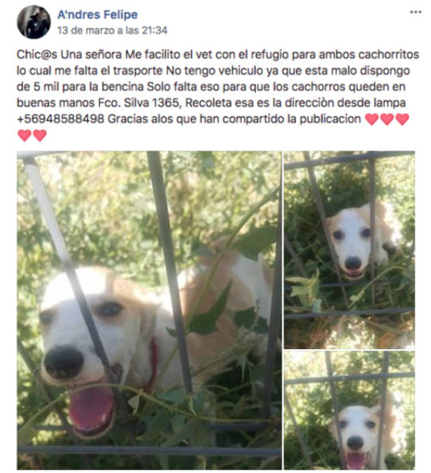
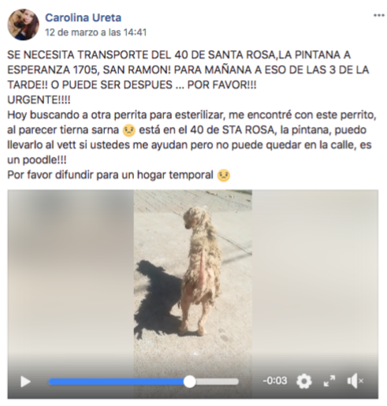

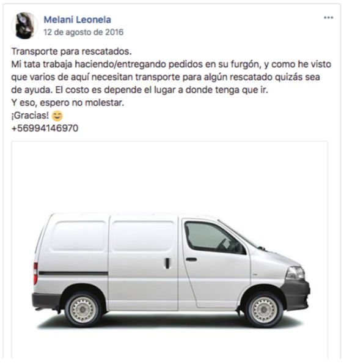

La idea es crear un directorio con los nombres y datos de contactos de aquellas personas que pueden ayudar en el traslado.
Por último, la sección “a domicilio” es un listado de servicio de ambulancias y de veterinarios a domicilio.

En el caso de las ambulancias, no existe mucha oferta en el mercado, y la poca que hay no está bien difundida en internet, cuesta encontrar y algunos datos se obtienen de los mismos vehículos que se ven pasar en la calle.

En síntesis, SOS Mascotas es una recopilación en un mismo lugar de toda la información dispersa en buscadores, en redes sociales, en grupos específicos de ayuda animal, en donde además las publicaciones se van borrando o perdiendo entre las nuevas, y que colaboran a una mejor experiencia a aquellas necesidades manifestadas por los usuarios.
