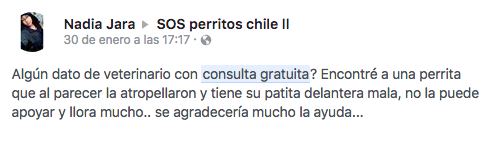

# sos-mascotas
SOS Mascotas es una app diseñada para encontrar centros veterinarios cerca de ti, saber cuáles están abiertos en la noche y para conseguir transporte para tu mascota

## Desarrollado para [Laboratoria](http://laboratoria.la)

# Primera parte: Descubrimiento
Navegando por Facebook, específicamente en redes de mascotas, tenencia responsable, adopciones y ayuda a animales abandonados, es común encontrar a usuarios que ante una eventualidad no saben a dónde dirigirse.

Estos usuarios hacen una publicación preguntando datos cercanos y por sobre todo económicos, pero en estos sitios ocurren dos fenómenos que juegan en contra para aquella persona que, ante una urgencia, necesita un dato rápido:
- Los usuarios no siempre están conectados, por lo que pasa mucho tiempo antes de que alguien le responda a esa persona que está en una situación donde requiere de una respuesta inmediata.
- En esos foros de Facebook se publican contenidos de todo tipo: desde animales en adopción, solicitud de aportes económicos, animales perdidos, denuncias por maltrato, entre otros. El efecto de esta mezcla de publicaciones, es que las que son de carácter urgente, se pierden entre las demás, van quedando cada vez más abajo en el timeline de la página y finalmente ya nadie las ve, perjudicando al usuario que pedía ayuda y a su mascota.

Por ello nació la inquietud de cómo ayudar a aquellos casos en donde la persona, desorientada, busca un lugar (con características específicas como precio, cercanía, horario, etc) para acudir de urgencia.
Es decir, sabe dónde acudir ante una emergencia veterinaria, optimizando el tiempo: que sea un lugar cercano y que atiendan de inmediato.

#Segunda parte: Research
Ante este panorama, realicé una pequeña encuesta de Facebook en algunos de estos grupos de ayuda a animales, enfocada a las atenciones de urgencia.
Las encuestas arrojaron dos panoramas muy diferentes: si tuvieran una emergencia en horario normal (de día, en la semana), un 68% de las personas afirmó saber a donde dirigirse.